# StockPost - MERN Stack Application

## Overview

StockPost is a MERN stack application I developed as an assigned project. It's a platform for sharing and interacting with stock-related posts. Key features:

- User authentication with JWT
- Post creation, commenting, and liking
- Real-time updates using Socket.io
- MongoDB for data storage

This repository contains the backend code, handling all server-side operations for StockPost.

---

<!-- hight list the next heading -->
## LINK FOR LIVE DEPLOYED BACKEND IN CASE YOU DON'T WANT TO SETUP LOCALLY
## THIS IS FREE SERVER AND IT MAY TAKE SOME TIME TO LOAD IN FIRST TIME
- https://backassignment.onrender.com/
## THIS IS ALSO ALREADY CONNECTED TO POSTMAN 

## Link of Documentation collection for Postman 
- https://documenter.getpostman.com/view/15799054/2sAXqmAk5M

## Collection Link
Link -1
- https://fullstackclass.postman.co/workspace/Assignment~c48c3db5-695b-4225-a22d-11b6d8cc3b79/collection/15799054-189a292b-d85f-4f60-82a5-04d8bb9d9a5c?action=share&creator=15799054&active-environment=15799054-b00b878e-a32c-45b3-b24d-af5ceb46da7d

Link -2
- https://documenter.getpostman.com/view/15799054/2sAXqmAk5M


Link for Socket.io collection 
- https://fullstackclass.postman.co/workspace/Assignment~c48c3db5-695b-4225-a22d-11b6d8cc3b79/collection/66e10157406ecba7a2d9a318?action=share&creator=15799054
---

## Features

1. **User Authentication**: Register, login, and update profile (username, bio, profile picture) using JWT tokens.
2. **Stock Post Management**: Users can create posts related to specific stocks with stock symbols, titles, descriptions, and tags.
3. **Commenting System**: Users can comment on posts. Comments are linked to both the user and the post.
4. **Like System**: Users can like or unlike posts. The total number of likes is displayed on each post.
5. **Filtering and Sorting**: Posts can be filtered by stock symbol or tags, and sorted by date or number of likes.
6. **Pagination**: Supports pagination when fetching posts.
7. **Real-time Updates**: Real-time updates for comments and likes using **Socket.io**.
8. **API Documentation**: Optional API documentation using **Postman**.
---

## Features and Implementation

### 1. User Authentication

**Feature:** Register, login, and update profile (username, bio, profile picture) using JWT tokens.

**Implementation:**
- Utilized JWT (JSON Web Tokens) for secure authentication
- Implemented both access tokens and refresh tokens for enhanced security
- Used bcrypt for password hashing to ensure password security
- Integrated cookie-based authentication for a seamless user experience
- Created middleware to verify and validate tokens on protected routes

Our authentication flow ensures that user credentials are securely managed and that access to protected resources is carefully controlled.

- JWT Token Generation
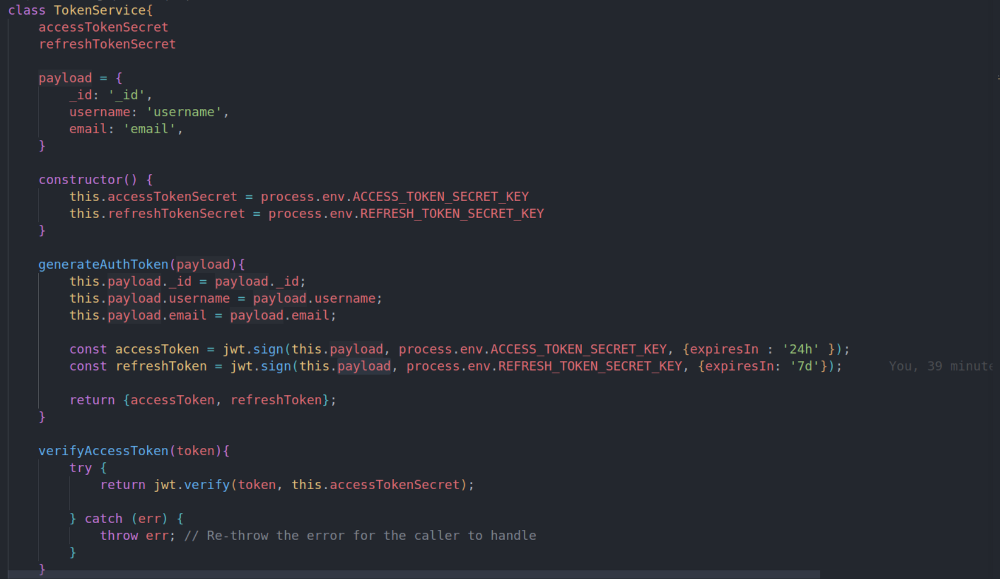

- JWT Token Verification
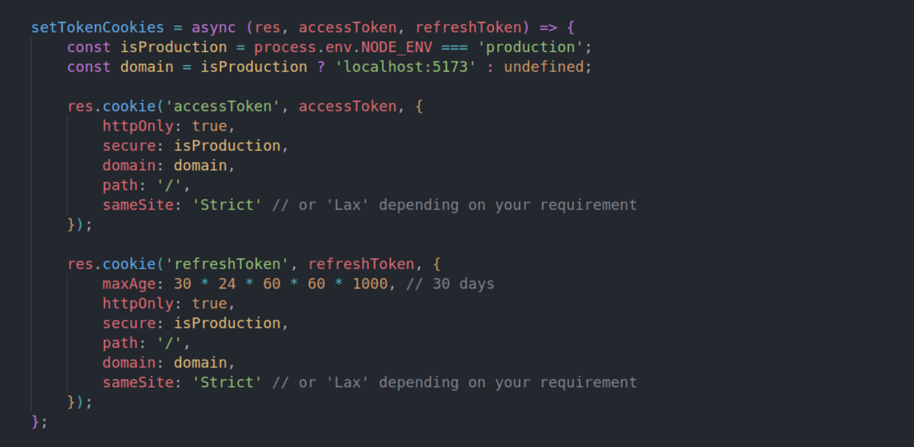

- bcrypt Password Hashing
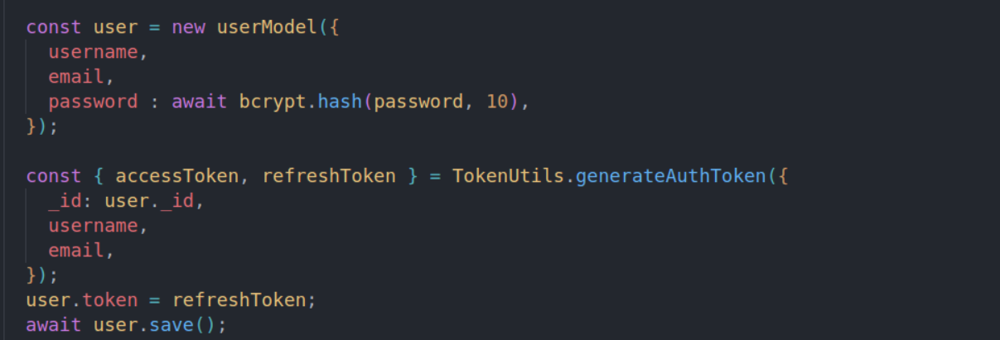

- Cookie-based Authentication
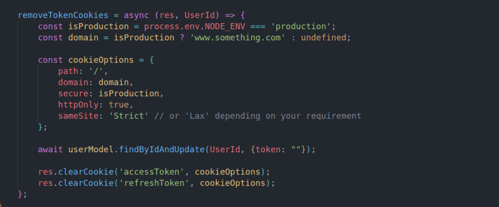

- Middleware for Token Verification
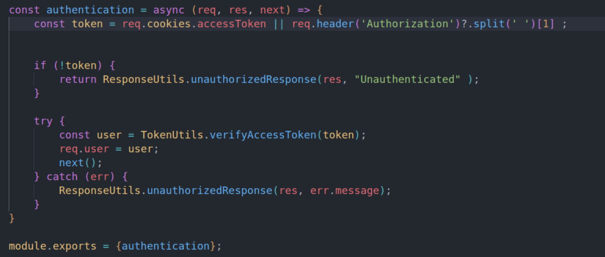

### 2. Stock Post Management

**Feature:** Users can create posts related to specific stocks with stock symbols, titles, descriptions, and tags.

**Implementation:**
- Designed a robust database schema to store post information
- Created API endpoints for CRUD operations on posts
- Implemented input validation to ensure data integrity
- Added authorization checks to ensure only authenticated users can create posts

Users can easily create, edit, and delete their stock-related posts, providing valuable insights to the community.

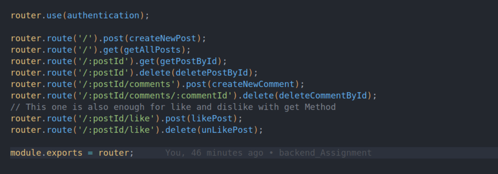

### 3. Commenting System

**Feature:** Users can comment on posts. Comments are linked to both the user and the post.

**Implementation:**
- Developed a NoSql database structure to link comments with users and posts
- Created API endpoints for adding, editing, and deleting comments
- Implemented commenting functionality 
- Added real-time updates for comments using Socket.io

Our commenting system fosters engaging discussions around stock posts, allowing users to share their thoughts and insights.
- Database Schema for Comments
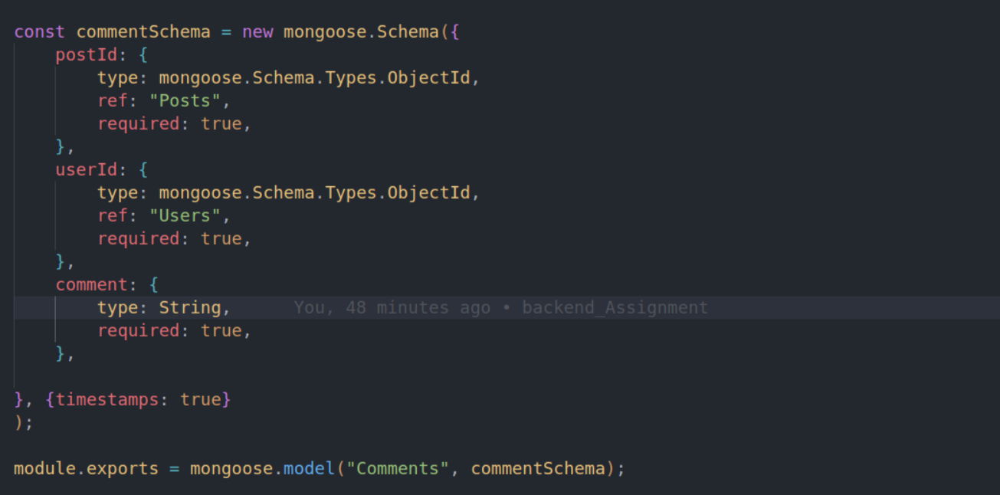
- Real-time Updates for Comments
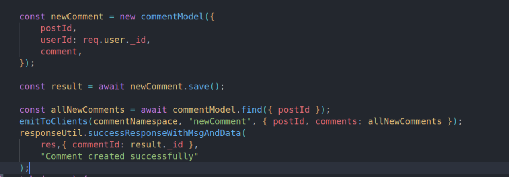

### 4. Like System

**Feature:** Users can like or unlike posts. The total number of likes is displayed on each post.

**Implementation:**
- Created a many-to-many relationship between users and posts for likes
- Implemented API endpoints for liking and unliking posts
- Added a counter for total likes on each post
- Ensured real-time updates of like counts using Socket.io

The like system provides a quick way for users to show appreciation for valuable posts and helps surface popular content.

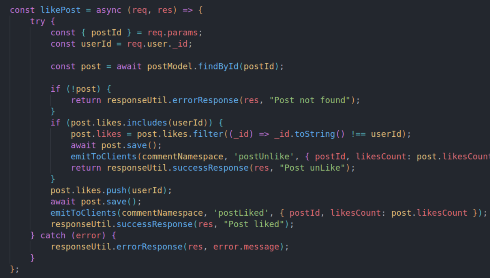

### 5. Filtering and Sorting

**Feature:** Posts can be filtered by stock symbol or tags, and sorted by date or number of likes.

**Implementation:**
- Developed flexible API endpoints that accept query parameters for filtering and sorting
- Implemented database queries to efficiently filter and sort posts
- Created a user-friendly interface for applying filters and sorts

Users can easily find relevant content by filtering posts based on their interests and sorting them according to their preferences.

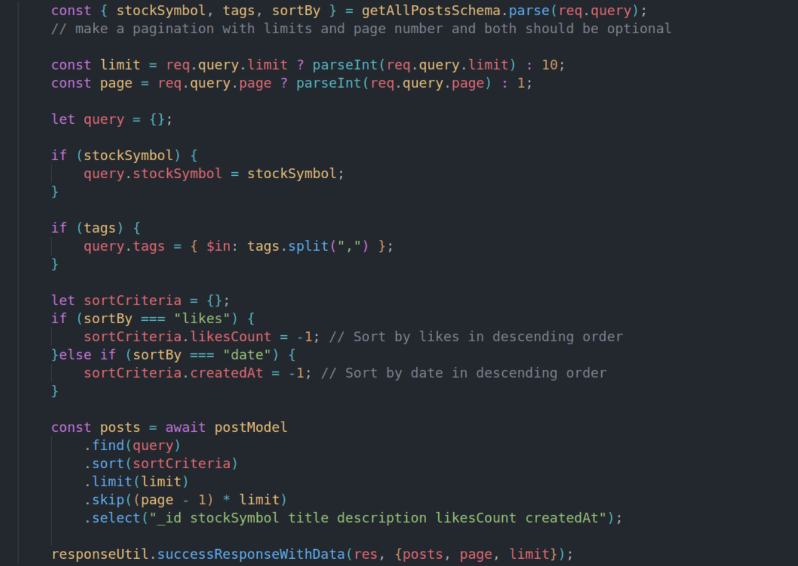

### 6. Pagination

**Feature:** Supports pagination when fetching posts.

**Implementation:**
- Implemented cursor-based pagination for efficient data fetching
- Added pagination parameters to relevant API endpoints
- Ensured smooth integration with filtering and sorting features

Pagination improves application performance and user experience by loading data in manageable chunks.


### 7. Real-time Updates

**Feature:** Real-time updates for comments and likes using Socket.io.

**Implementation:**
- Integrated Socket.io for WebSocket communication
- Implemented event emissions for new comments, likes, and posts
- Created client-side listeners to update the UI in real-time
- Ensured proper error handling and reconnection logic

Real-time updates create a dynamic and engaging user experience, allowing users to see new content as it's created.

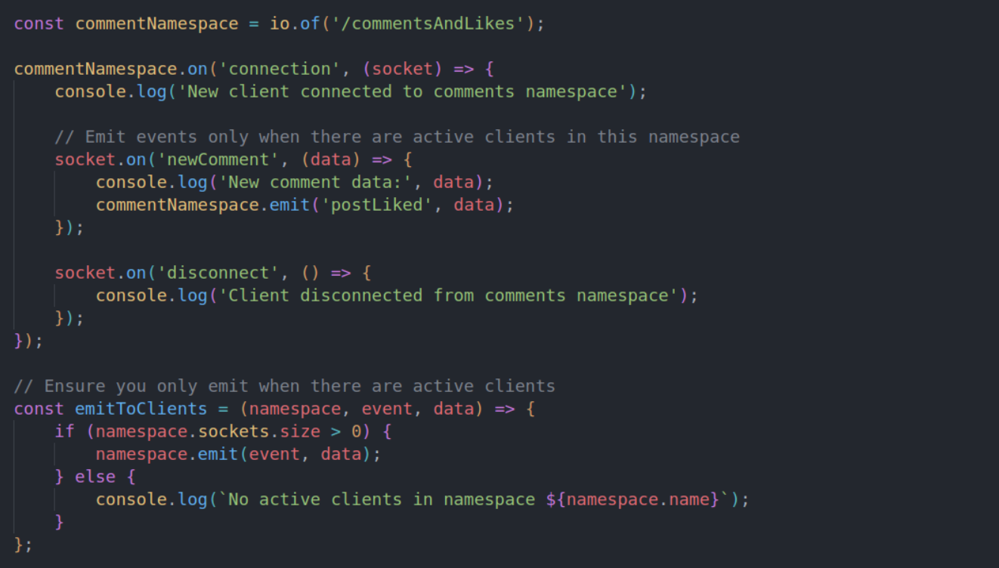

### 8. API Documentation

**Feature:** Optional API documentation using Postman.

**Implementation:**
- Created comprehensive API documentation using Postman
- Included detailed descriptions for each endpoint, including request/response formats
- Provided example requests and responses for easy understanding
- Ensured documentation is kept up-to-date with API changes


### 9. Zod Schema Validation

**Feature:** Implemented Zod for JavaScript schema validation.

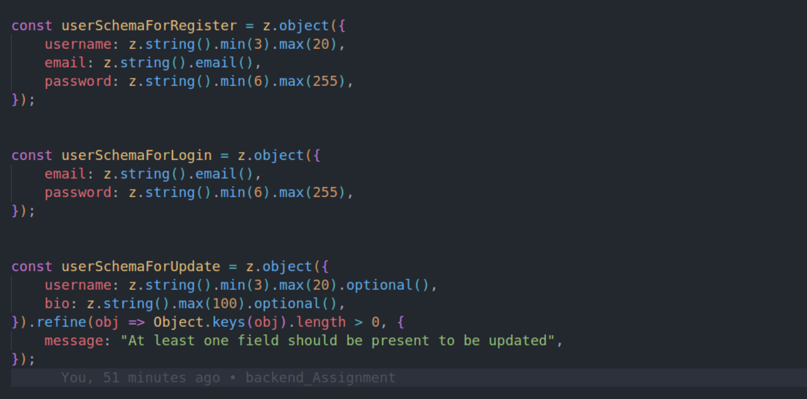

---

## Tech Stack

- **MongoDB**: For data storage.
- **Express.js**: Backend server and API routes.
- **Node.js**: Server-side JavaScript runtime.
- **JWT (JSON Web Token)**: For authentication and authorization.
- **Socket.io**: Real-time updates for comments and likes.
- **Mongoose**: MongoDB ODM for schema modeling and data handling.
- **Jest**: Testing framework for unit and integration tests.
- **Bcrypt**: Password hashing for secure user authentication.
- **Multer**: Middleware for handling file uploads.
- **Cloudinary**: Cloud-based image for profile pictures.
- **Zod**: JavaScript schema validation library.

---

## Table of Contents

- [Installation](#installation)
- [API Endpoints](#api-endpoints)
  - [Authentication](#user-authentication)
  - [Posts](#stock-posts-management)
  - [Comments](#comments-management)
  - [Likes](#like-system)
  - [Real-time Updates](#real-time-updates)
- [Database Schema](#database-schema)
- [Running Tests](#running-tests)
- [Socket.io Real-time Updates](#socketio-real-time-updates)

---

## Installation

### Prerequisites

- **Node.js** (v14 or higher)
- **MongoDB** (Running locally or using a cloud service like MongoDB Atlas)

### Steps

1. **Clone the repository**:

   ```bash
   git clone https://github.com/Surajsinhar77/BackAssignment.git
   ```

2. **Navigate into the project directory**:

   ```bash
   cd StockPost
   ```

3. **Install dependencies**:

   ```bash
   npm install
   ```

4. **Create a `.env` file** in the root directory with the following environment variables:

   ```bash
    DATABASE_URI=mongodb+srv://<username>:<password>@<cluster-url>/<database-name>
    PORT=5000
    ACCESS_TOKEN_SECRET_KEY=your-access-token-secret
    REFRESH_TOKEN_SECRET_KEY=your-refresh-token-secret
    CLOUD_NAME=your-cloudinary-cloud-name
    CLOUD_API_KEY=your-cloudinary-api-key
    API_SECRET=your-cloudinary-api-secret
    CLOUDINARY_URL=cloudinary://your-cloudinary-url
    SESSION_SECRET=your-session-secret
    NODE_ENV=development
   ```

5. **Start the development server**:

   ```bash
   npm run dev
   ```

   The backend will start running on `http://localhost:5000`.
   The socket server will start running on `http://localhost:5000`.

---

## API Endpoints

### User Authentication

1. **Register** - `POST /api/auth/register`

   Request:

   ```json
    {
        "username": "suraj",
        "email": "suraj123@gmail.com",
        "password": "password123"
    }
   ```

   Response:

   ```json
    {
        "success": true,
        "message": "User registered successfully",
        "data": {
            "userId": "66e1500765a87221b49f757c"
        }
    }
   ```

2. **Login** - `POST /api/auth/login`

   Request:

   ```json
    {
        "email": "suraj123@gmail.com",
        "password": "password123"
    }
   ```

   Response:

   ```json
    {
        "data": {
            "token": "your-access-token",
            "user": {
                "_id": "66e1500765a87221b49f757c",
                "username": "suraj",
                "email": "suraj123@gmail.com"
            }
        }
    }
   ```

3. **Get User Profile** - `GET /api/user/profile/:userId`

    Headers: `{ Authorization: Bearer <token> }`
    Response:
    
    ```json
    {
        "data": {
            "_id": "66dfd7b8e6558cd09067e7ed",
            "username": "suraj",
            "bio": "I am Full Stack developer and Mern Stack",
            "profilePicture": "https://res.cloudinary.com/do4cvkenc/image/upload/v1725947975/uploads/profile-images/wkfwjseoedvxyjutegfc.jpg",
            "createdAt": "2024-09-10T05:23:04.882Z"
        }
    }
    ```

4. **Update User Profile** - `PUT /api/user/profile`

    Response:

    ```json
    {
        "success": true,
        "message": "Profile updated successfully"
    }
    ```
---

### Stock Posts Management

1. **Create a Stock Post** - `POST /api/posts`

   Headers: `{ Authorization: Bearer <token> }`

   Request:

   ```json
    {
        "stockSymbol": "AAPL",
        "title": "Apple Stock Discussion",
        "description": "Discussing about Apple stock performance",
        "tags": ["tech", "investment"]
    }
   ```

2. **Get All Stock Posts** - `GET /api/posts`

   Optional query parameters: `stockSymbol`, `tags`, `sortBy`
   Request : `GET /api/posts?stockSymbol=AAPL&tags=tech&sortBy=likes`

   Response:

   ```json
   {
        "data": {
            "posts": [
                {
                    "_id": "66dff5ff0ca42f8d2c950c23",
                    "stockSymbol": "AAGL",
                    "title": "This is title post",
                    "description": "The descriptionof the post in long",
                    "likesCount": 0,
                    "createdAt": "2024-09-10T07:32:15.029Z"
                },
                {
                    "_id": "66dff5ff0ca42f8d2c950c25",
                    "stockSymbol": "AAGL",
                    "title": "This is title post",
                    "description": "The descriptionof the post in long",
                    "likesCount": 1,
                    "createdAt": "2024-09-10T07:32:15.991Z"
                }
            ],
            "page": 1,
            "limit": 10
        }
    }
   ```

3. **Get a Single Stock Post** - `GET /api/posts/:postId`

4. **Delete a Stock Post** - `DELETE /api/posts/:postId`

---

### Comments Management

1. **Add a Comment** - `POST /api/posts/:postId/comments`

   Request:

   ```json
   {
     "comment": "This is a comment."
   }
   ```

2. **Delete a Comment** - `DELETE /api/posts/:postId/comments/:commentId`

---

### Like System

1. **Like a Post** - `POST /api/posts/:postId/like`

2. **Unlike a Post** - `DELETE /api/posts/:postId/like`

---

### Real-time Updates

- **Socket.io Events**: Users receive real-time updates when a new comment or like is added to a post they are viewing.
- **Socket request URL** - "http://localhost:5000/commentsAndLikes"
    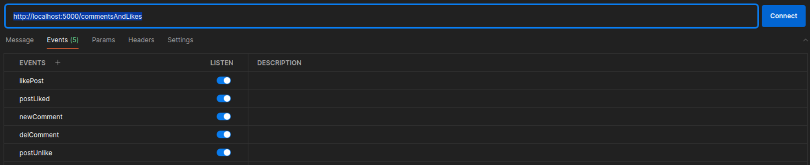
    Add all the Events in the socket.io client side code to get the real time updates.
    - `likePost`: Broadcasted when a post is liked.
    - `commentPost`: Broadcasted when a new comment is added to a post.
    - `delComment`: Broadcasted when a comment is deleted from a post.
    - `postUnlike`: Broadcasted when a post is unLiked.
    - `newComment`: Broadcasted when a new comment is added to a post.
---

## Database Schema

### User Model

- `username`: String
- `email`: String
- `password`: String (hashed)
- `bio`: String (optional)
- `profilePicture`: String (optional)

### Post Model

- `stockSymbol`: String
- `title`: String
- `description`: String
- `tags`: [String] (optional)
- `createdAt`: Date
- `user`: ObjectId (linked to User model)

### Comment Model

- `post`: ObjectId (linked to Post)
- `user`: ObjectId (linked to User)
- `comment`: String
- `createdAt`: Date

### Like Model

- `post`: ObjectId (linked to Post)
- `user`: ObjectId (linked to User)

---

## Running Tests

Testing can be done using **Jest**.

1. **Install Jest**:

   ```bash
   npm install --save-dev jest
   ```

2. **Run Tests**:

   ```bash
   npm run test
   ```

---

## Socket.io Real-time Updates

Real-time updates for likes and comments are powered by **Socket.io**. When a user adds a comment or likes a post, all connected users viewing that post will get the update in real time.

### Socket Events

- `newComment`: Broadcasted when a new comment is added to a post.
- `newLike`: Broadcasted when a post is liked.

---

<!-- ## Contributing

Contributions are welcome! Please follow the guidelines below:

1. Fork the repository.
2. Create a new branch (`git checkout -b feature-name`).
3. Make your changes.
4. Commit your changes (`git commit -m 'Add new feature'`).
5. Push to the branch (`git push origin feature-name`).
6. Create a pull request.

--- -->

By following this guide, you will have a fully functional backend setup for the StockPost application.